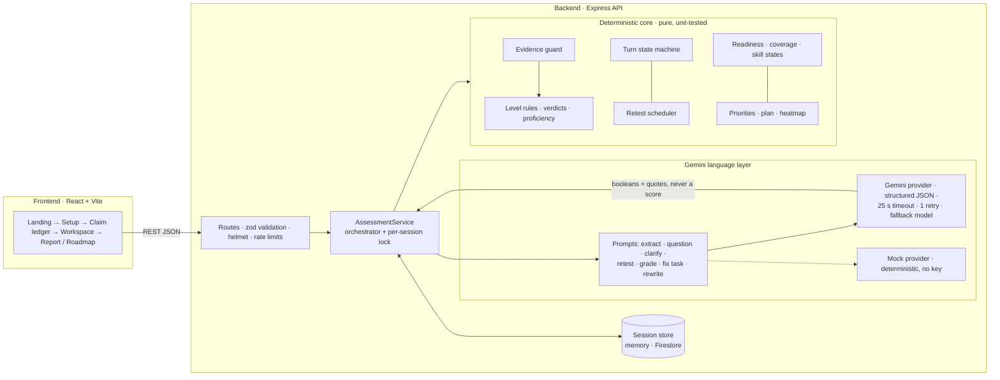

# UNBLUFF


**Your resume says you're ready. Let's prove it.** UNBLUFF is a mock placement interviewer that
checks every claim on a student's resume against a target role and shows, with evidence from their
own answers, what they can defend and what they need to fix.

## Problem statement → UNBLUFF

| The student needs to know… | How UNBLUFF answers it |
|---|---|
| **What to prepare** | Pick a role → the resume becomes a list of verifiable claims mapped to the role's weighted skills. **Blind spots** list required skills the student never claimed. |
| **Where they stand** | Each claim is interrogated on 3 levels and ends **Defended / Shaky / Bluff / Honest gap**. The report shows readiness (0–100), role coverage, a resume heatmap, and per-skill states, each backed by verbatim quotes. |
| **What to improve** | Top-3 **priorities** ranked by `weight × (1 − proficiency)`, a **root cause** (the most fundamental missing prerequisite) per weak claim, and honest resume rewrites. |
| **How to prepare** | A targeted **fix task** (explanation + exercise) per weak claim, a **7-day plan**, a 4-week roadmap preview, and a **delayed retest** that proves the improvement. |

## What makes it different

- **Claim-based, 3-level interrogation.** Every resume claim is probed at **L1 What** (what *you*
  built), **L2 How** (the mechanism) and **L3 Why** (when *not* to use it, defending it against an
  alternative). One follow-up is allowed per level when an answer is too vague.
- **Root-cause diagnosis.** Each role skill lists 3–5 prerequisites. Grading names the most
  fundamental one the answer is missing. Code keeps it only if it's exactly on the list, and it costs
  no extra LLM call.
- **Delayed, interleaved, fresh-scenario retest.** Opening a fix task schedules a retest that unlocks
  only after **2 other claims** are completed. The retest is a *new* scenario question, never a repeat.
  `interleaved_claims` records the real gap.
- **Deterministic core with an evidence guard.** The LLM only returns per-criterion booleans plus
  quotes. A criterion counts only if its quote is a **verbatim substring** of the student's answer.
  Pass/fail, verdicts, proficiency, readiness, coverage, priorities and scheduling are pure,
  unit-tested code, so the same answers always get the same score.

## Architecture



The full API contract (types, endpoints, errors, display mapping, mock report) is in
[`CONTRACT.md`](CONTRACT.md). Design decisions and trade-offs are in [`DECISIONS.md`](DECISIONS.md).

## Google services

| Service | Status | Where |
|---|---|---|
| **Gemini API** via the official **Google Gen AI SDK** (`@google/genai`) | ✅ Live when `LLM_MODE=live` | `backend/src/llm/gemini.ts`: structured output (`responseJsonSchema`), thinking level, timeout, primary `gemini-3.1-flash-lite` + fallback `gemini-3.6-flash` on 429/5xx |
| **Cloud Run** + **Cloud Build** + **Artifact Registry** | ⚙️ Implemented, not deployed (needs billing) | `backend/Dockerfile`, `backend/scripts/deploy.sh` (`gcloud run deploy --source backend`) |
| **Firestore** | ⚙️ Implemented, not deployed | `backend/src/store/firestoreStore.ts` (`STORE=firestore`), unit-tested with a mocked client |
| **Secret Manager** | ⚙️ Implemented, not deployed | `deploy.sh` pipes the key in via stdin and mounts it with `--set-secrets` |
| **Cloud Logging** format | ✅ In code | `backend/src/logger.ts`: pino logs carry Cloud Logging `severity`; every LLM call logs prompt, model, latency, validity |
| **Firebase Hosting** | ⚙️ Configured, not deployed | `firebase.json` / `.firebaserc` serve `frontend/dist` as an SPA |

## Tech stack

- **Backend:** Node 20, TypeScript (strict), Express 5, zod, `@google/genai`, pino, helmet,
  express-rate-limit, `@google-cloud/firestore`; tests with Vitest + Supertest.
- **Frontend:** React 18, TypeScript (strict), Vite, Tailwind CSS, React Router, lucide-react,
  pdf.js (loaded only when a PDF is chosen); tests with Vitest + Testing Library.
- **Tooling:** ESLint (typescript-eslint, jsx-a11y), Prettier, GitHub Actions CI, Docker, Render Blueprint.

## Run locally

Backend on `:8090` in mock mode (deterministic, **no API key needed**):

```bash
cd backend && npm ci && LLM_MODE=mock STORE=memory PORT=8090 CORS_ORIGIN=http://localhost:5173 npm run dev
```

Frontend (`frontend/.env` contains `VITE_API_URL=http://localhost:8090`, as in `.env.example`):

```bash
cd frontend && npm ci && cp .env.example .env && npm run dev
```

Then open http://localhost:5173. For live Gemini, set `LLM_MODE=live`, `GEMINI_API_KEY` and
`GEMINI_MODEL` in `backend/.env` (see `backend/.env.example`).

**How to demo (3 min):** View Demo Report → open a heatmap line (evidence drawer) → Audit My Readiness
→ *Teach me* → paste 3 resume lines → answer claim 1 "I don't know" (honest gap + root cause + fix
task) → answer the next two → "Welcome back — a new scenario" → pass the retest → the report shows
"Verified after 2 other concepts".

## Testing

```bash
cd backend  && npm run lint && npm run typecheck && npm test
cd frontend && npm run lint && npm run typecheck && npm test && npm run build
```

Latest run: **backend 129 tests** (21 files) and **frontend 26 tests** (7 files), all passing. The
backend's deterministic core (`src/core`) is at 100% line coverage, and CI enforces ≥ 95%.

- Backend: level rules, evidence guard, turn state machine, retest scheduler, scoring, plan,
  heatmap, report, Gemini provider (retry, fallback, timeout, with a fake client), Firestore store
  (mocked), prompts, contract drift guards, and full HTTP flows (errors, security, efficiency,
  prepare-mode learning loop, long single-line resumes).
- Frontend: API error mapping, Setup sends `mode`, ledger delete → confirm payload, clarify tag,
  teach-now fix card, retest banner, report verdict labels, evidence drawer keyboard flow, wake-up
  gate, roadmap builder.
- `frontend/scripts/e2e-check.mjs` runs the whole loop against a running backend with the UI's exact payloads.
- `backend/scripts/grade_check.ts` is a live Gemini grading check (strong / wrong / "I don't know" /
  vague / prompt injection / off-topic), 6/6 on both models.

## Security, accessibility, efficiency

**Security**
- Strict zod request schemas (unknown keys rejected) and a 100 kB body limit.
- helmet headers, CORS allow-list, global + LLM-route rate limits.
- Errors use the contract shape, never stack traces.
- Keys only from env / Secret Manager, redacted from logs.
- Prompt-injection defense: student text is wrapped in tags it can't close, and the evidence guard means a fooled model still can't pass a criterion.

**Accessibility**
- One `h1` per page, landmarks, labelled inputs, jsx-a11y lint.
- Focus moves to each new question; `aria-live` for questions and verdicts.
- `role="status"` loaders, `role="alert"` errors.
- Modal evidence drawer with focus trap, Esc and focus return.
- Verdicts always shown as label + icon + color (WCAG-AA colors, CONTRACT.md §6).
- Respects `prefers-reduced-motion`.

**Efficiency**
- Report-time LLM output is cached per claim (a report refetch = 0 LLM calls, tested), with at most 2 concurrent calls, stopping on the first failure.
- A per-session lock stops double submits.
- Resuming an open question is free.
- Workspace, Report and Roadmap are code-split, and pdf.js loads on demand.
- The fallback model plus a quota cooldown keep the free tier usable.

## Roadmap

- Company-specific practice (questions tuned to a target company's stack)
- Full mock interview mode
- Aptitude rounds
- Activity tracking across sessions
- Placement-cell dashboard for cohorts
